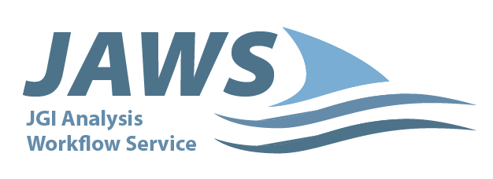

# CDM Task Service

**This is currently a prototype**

Enables running jobs on remote compute from the KBase CDM cluster.

## Nomenclature

* CDM: Central Data Model
  * The KBase data model
* CTS: CDM Task Service

## Usage notes

The CTS uses CRC64/NVME checksums on all input and output files for data integrity checks and
to ensure files do not unexpectedly change over time. As such, all input files in S3 must
have the checksums stored in their metadata. A user can check this via various methods, but
here we use the Minio client, `mc`. Assuming the alias for the S3 installation is `local9002`:

```
$ ./mc stat local9002/test-bucket/test-file-with-checksum
Name      : test-file-with-checksum
Date      : 2025-02-26 16:52:49 PST 
Size      : 8 B    
ETag      : 1b9554867d35f0d59e4705f6b2712cd1 
Type      : file 
Checksum  : CRC64NVME:S8AXmd7A3f8=
Metadata  :
  Content-Type: application/octet-stream
```

Files without the CRC64NVME checksum will be rejected by the service.

To include a checksum on upload with `mc`, use the `--checksum` argument:

```
./mc cp --checksum crc64nvme tinyfile.crap local9002/test-bucket/test-file-with-checksum
...yfile.crap: 8 B / 8 B ┃▓▓▓▓▓▓▓▓▓▓▓▓▓▓▓▓▓▓▓▓▓▓▓▓▓▓▓▓▓▓▓▓▓▓▓▓▓▓▓▓▓▓▓┃ 60 B/s 0s
```

If a file already exists in S3 but has no checksum, one can be added via a copy:

```
$ ./mc stat local9002/test-bucket/test-file-no-checksum
Name      : test-file-no-checksum
Date      : 2025-02-26 16:52:33 PST 
Size      : 8 B    
ETag      : 1b9554867d35f0d59e4705f6b2712cd1 
Type      : file 
Metadata  :
  Content-Type: application/octet-stream 

~$ ./mc cp --checksum crc64nvme local9002/test-bucket/test-file-no-checksum local9002/test-bucket/test-file-now-with-more-checksums
...o-checksum: 8 B / 8 B ┃▓▓▓▓▓▓▓▓▓▓▓▓▓▓▓▓▓▓▓▓▓▓▓▓▓▓▓▓▓▓▓▓▓▓▓▓▓▓▓▓▓▓▓┃ 37 B/s 0s

~$ ./mc stat local9002/test-bucket/test-file-now-with-more-checksums
Name      : test-file-now-with-more-checksums
Date      : 2025-02-26 16:57:06 PST 
Size      : 8 B    
ETag      : 1b9554867d35f0d59e4705f6b2712cd1 
Type      : file 
Checksum  : CRC64NVME:S8AXmd7A3f8=
Metadata  :
  Content-Type: application/octet-stream 
```

### Further usage documentation

* The service OpenAPI documentation
  * https://ci.kbase.us/services/cts/docs
* Image setup and running documentation / examples:
  * [./docs/](./docs/)

## Service Requirements

* Python 3.12+
* [crane](https://github.com/google/go-containerregistry/blob/main/cmd/crane/README.md)
* An S3 instance for use as a file store, but see "S3 requirements" below
* MongoDB 7+
* Kafka 2.1+
* If submitting jobs to HTCondor, see HTCondor requirements below

### S3 requirements

* Path style access is required.
* The service does not support objects encrypted with customer supplied keys or with the
  AWS key management service.
* The provided credentials must enable listing readable buckets, as the service performs that
  operation to check the host and credentials on startup.
* If using Minio, the minimum version is `2025-02-07T23-21-09Z`.

### HTCondor requirements

Due to the multitude of ways HTCondor (HTC) connectivity and authentication can be configured,
the service does not expect any particular HTC configuration other than calling

```python
import htcondor2

schedd = htcondor2.Schedd()
```

... should Just Work (TM) and jobs should be able to be submitted with that `Schedd` instance.
At minimum some sort of authentication must be set up and `COLLECTOR_HOST` must be supplied
in a config file or the environment (via `_CONDOR_COLLECTOR_HOST`).

The service administrator is expected to set up the HTCondor configuration so that the above
is true. If using the Docker image, a configuration file and / or credentials will likely need
to be mounted into the container, e.g.

* An `IDTOKEN` and, if necessary, the `_CONDOR_SEC_TOKEN_DIRECTORY` to tell HTC the token's
  location.
* A condor configuration file and password file if using `PASSWORD` authentication.

Furthermore each HTCondor worker must have the necessary secrets provided in files for the
executor to read:

* a KBase token with an auth2 role indicating the user is a CTS external executor
* the S3 access secret

See the HTCondor section of [cdmtaskservice_config.toml.jinja](cdmtaskservice_config.toml.jinja).

## Powered by

<div>
  <a href="https://jaws-docs.readthedocs.io" title="JGI JAWS">
      
  </a>
</div>

<div>
  <a href="https://htcondor.org/" title="HTcondor">
      
  </a>
</div>

## Development

### Adding code

* In this alpha / prototype stage, we will be PRing (do not push directly) to `main`. In the
  future, once we want to deploy beyond CI, we will add a `develop` branch.
* The PR creator merges the PR and deletes branches (after builds / tests / linters complete).

### Code requirements for prototype code

* Any code committed must at least have a test file that imports it and runs a noop test so that
  the code is shown with no coverage in the coverage statistics. This will make it clear what
  code needs tests when we move beyond the prototype stage.
* Each module should have its own test file. Eventually these will be expanded into unit tests
  (or integration tests in the case of app.py)
* Any code committed must have regular code and user documentation so that future devs
  converting the code to production can understand it.
* Release notes are not strictly necessary while deploying to CI, but a concrete version (e.g.
  no `-dev*` or `-prototype*` suffix) will be required outside of that environment. On a case by
  case basis, add release notes and bump the prototype version (e.g. 0.1.0-prototype3 ->
  0.1.0-prototype4) for changes that should be documented.

### Running tests

Docker must be installed.

Copy `test.cfg.example` to `test.cfg` and fill it in appropriately.

```
uv sync --dev  # only the first time or when uv.lock changes
PYTHONPATH=. uv run pytest test
```

### Exit from prototype status

* Coverage badge in Readme
* Run through all code, refactor to production quality
* Add tests where missing (which is a lot) and inspect current tests for completeness and quality
  * E.g. don't assume existing tests are any good
  * Async testing help
    https://tonybaloney.github.io/posts/async-test-patterns-for-pytest-and-unittest.html