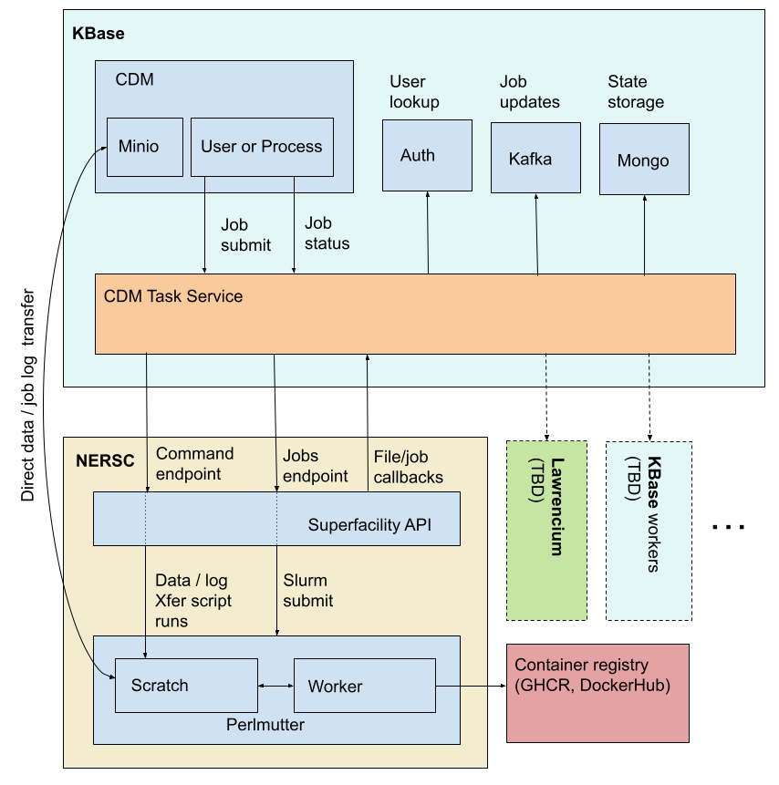

# CDM Task Service design

## Motivation

We want to make it reasonably simple for KBase staff, especially scientifically (as opposed
to development) oriented staff, to run jobs for CDM work on cluster hardware like the
[NERSC Perlmutter system](https://docs.nersc.gov/jobs/) and
[Lawrencium](https://scienceit-docs.lbl.gov/hpc/). In particular:

* They should be able to use their KBase credentials to run jobs  
  * See [Appendix 2: NERSC job running policy](#appendix-2-nersc-job-running-policy) and
    [Appendix 3: NERSC server policies](#appendix-3-nersc-server-policies) regarding NERSC
    job running policies  
    * In particular, any service access by a user needs to be logged, and the logs need to be
      mappable to NERSC users  
* They should not need to understand the technical details of  
  * Transferring files to and from the cluster from the CDM storage systems  
  * Slurm  
  * Job submission scripts  
* They should be able to make a simple API call with the input data location, details on the job
  to run, and location to place results, and the system should take care of everything else.

## Strategy

Start with the simplest possible set of features and deploy a prototype service, then add
new features ([Future work](#future-work)) and productionize as needed. In particular, we will
only support NERSC in the first iteration of the system as the Superfacility API makes it
relatively easy to use, team members have extensive experience with running jobs on NERSC,
and we already have significant code available around submitting jobs. That being said, we
will attempt to make the service design flexible enough that the future work features can be
added with minimal database retrofits and ideally not too much code refactoring.

## Nomenclature

* CDM - the KBase Central Data Model
* SFAPI - NERSC Superfaciltiy API

## Architecture

The service is expected to handle

* Transferring a user’s data from the CDM data store to the compute cluster  
* Running job based on a single container on the cluster  
  * The container must be approved by service admins but it otherwise arbitrary, as long as it
    can be run by specifying input / output paths and parameters  
* Transferring the results back to the CDM data store.

### High Level / Cross Organization



### Sequence of operations

#### Server startup

On startup, the server uses the `/utilities/upload` API to load job running and data
transfer code to Perlmutter. This also confirms connectivity and credentials.

* Use the `/utilities/command` endpoint to atomically `rename` the script(s) to their
  final locations to avoid race conditions causing corrupted files in the case of multiple
  servers starting at different times.  
* Also ensure any libraries / 3rd party binaries are installed or install them.  
  * Minio clients / pip installs / jars / etc.  
* Version script folders so different versions of the service don’t clobber each other’s scripts.

#### Job request

1. User makes an HTTP request to the integration service. See [Submit job](#submit-job)  
2. Service performs sanity checks  
   1. Is the user authorized to use the server?
      1. Pull the user's roles from the KBase auth server. Check that
         1. The user has a role indicating they are KBase staff
         2. The user has a role indicating they have a NERSC account
            1. When multiple compute sites are supported this will need adjustment
   2. Is the container on the allowed list?  
      1. Will need admin server APIs to view and modify the container allow list  
   3. Do the input files exist in Minio?  
      1. Server has to be able to read all relevant buckets  
   4. Does the output bucket exist in Minio?
   5. If reference data is required, is it ready?
3. Service stores job specification to MongoDB. See [Job](#job)  
4. Service sends job created message to Kafka  
5. Service uses the `/utilities/command` SFAPI endpoint to run a data setup script  
   1. If necessary, use the upload endpoint to upload extra data - file manifests, for example  
   2. Create a job directory in Perlmutter scratch  
   3. Transfer the Minio data to the job directory  
      1. Use presigned URLs to avoid passing credentials  
      2. Check file integrity  
   4. In parallel, pull the container from the registry  
   5. None of these steps count against NERSC allocation  
   6. When complete, `touch` a completion signifier file  
6. Service stores the task ID and submit time for the command in Mongo and updates state to
   data upload  
7. Service uses the `/callback` SFAPI endpoint to register a callback for the completion
   signifier file  
   1. Note the `/callback` endpoint is currently in beta.
      See [Appendix 1: Resources](#appendix-1-resources)  
8. Service updates job state in Kafka  
9. Service returns job ID to user

#### On upload completion signifier file callback

1. Service extracts job ID from path in URL  
2. Service checks state of the job ID in Mongo  
   1. If not in the data upload state something is wrong  
3. Service checks upload task id at the SFAPI `/tasks` endpoint and checks output is as expected  
4. Service updates MongoDB with relevant task output and submitting job state  
   1. Ensure state hasn’t changed in the meantime  
5. Service creates a Slurm submit file and uses the SFAPI `/compute/jobs` endpoint to submit
   the job run  
   1. This will start the specified container **by the container hash** with the specified
      parameters on the NERSC workers  
      1. The hash prevents approved containers from being altered after being added to the
         service, which is possible if the image is just identified by image name & tag  
      2. At the end of the run, pipe the container logs to a file  
   2. Store all runner script output in a file  
   3. Submit a callback along with job  
   4. When job is complete, create an upload manifest by recursiveley listing the files in the
      output directory.
6. Service stores the NERSC job ID and job submitted state in mongo  
7. Service updates job state in Kafka

#### On job callback

1. Service extracts job ID from URL  
2. Service checks state of job ID in Mongo  
   1. If not in the job submitted state something is wrong  
3. Service checks NERSC job ID at the SFAPI `/compute/jobs` endpoint and checks output is
   as expected  
4. Service updates MongoDB with relevant job output and retrieving data submission state  
   1. Ensure state hasn’t changed in the meantime
5. Service downloads the upload manifest created by the job
6. Service presigns upload urls for the files to be uploaded to Minio
7. Service creates an upload manifest with the file names and presigned urls and uploads the
   file to NERSC
8. Service uses the `/utilities/command` SFAPI endpoint to run a data retrieval script  
   1. Pushes the data in the job output directory to the manifest's presigned urls.
      1. May want to namespace allowed directories for writing by auth source and user name.  
   2. Pushes container and job runner logs to (potentially different) job directory in Minio  
      1. Maybe different buckets for logs & results  
      2. Use presigned URLs to avoid passing credentials  
   3. Check file integrity for all uploaded files via CRC32
   4. Deletes all output  
   5. When complete, `touch` a completion signifier file  
9. Service stores the task ID and submit time for the command in Mongo and updates state to
   data retrieval submitted  
10. Service uses the `/callback` SFAPI endpoint to register a callback for the completion
   signifier file  
11. Service updates job state in Kafka

#### On retrieval completion signifier file callback

1. Service extracts job ID from path in URL  
2. Service checks state of job ID in Mongo  
   1. If not in the data retrieval state something is wrong  
3. Service checks upload task id at the SFAPI `/tasks` endpoint and checks output is as expected  
4. Service updates MongoDB with relevant task output and completed job state  
   1. Store all new file paths in Minio  
   2. Ensure state hasn’t changed in the meantime
5. Service deletes the job directory at NERSC
6. Service updates job state in Kafka

#### On errors

* If an error occurs  
  * In the output of a task or job status check in the SFAPI  
  * When contacting an external service like Mongo, Kafka, the SFAPI, etc  
* Store the error in the job record and set the state to `error`.  
* See [Retries](#retries) for potential improvements.  
* Add an admin endpoint to restart a job from where it left off.

#### Reference data

Some containers will need large reference data that are not built into the containers
themselves to avoid massive container sizes. The service will manage staging refdata at NERSC
from archive files in Minio.

1. Service administrator makes request to service to stage a data file in Minio as reference
   data at NERSC.
   1. If the file is already registered in the service as reference data the call fails.
      1. A force option may be needed if the file has been since overwritten.
2. The service returns the reference data ID (a UUID) and starts a task via the SFAPI to download
   and optionally unpack / uncompress the files.
   1. Works the same way as data upload, described above in [Job Request](#job-request),
      including state checking to ensure that multiple uploads don't conflict with each other.
   2. Service creates a callback that will be triggered when the reference data is unpacked.
3. When the reference data is staged, the reference data is marked as ready to use for that
   environment (NERSC, Lawrencium, etc.)
4. In the meantime, a system administrator can approve a container and associate the reference
   data ID with the container.
   1. Future work - allow updating reference data for an existing container.
   2. While the reference data is being staged, jobs run for that container will refuse to start.
   3. A reference data ID can be associated with multiple containers - typically different
      version tags of the same tool.
5. When a job is run, the reference data is mounted, read only,  into the container at a
   point specified by the user.

Future work - automatically delete reference data that is no longer associated with any containers.

### Decisions necessary

#### Project name

We need a better project name than the CDM task service, especially if we’re thinking
this may be more generally useful than for CDM usage only.

**Decision** (24/08/06, CDM tech meeting): We’ll name the service the CDM Task Service.

#### User allowlist

The user allowlist prevents users that a) are not KBase staff and b) do not have a NERSC
account from using the server. There are at least 2 options for storing the allow list:

1. Store it via KBase Auth service roles  
   1. There’s a small amount of risk here that a KBase admin without a full understanding of
      the requirements of the role might carelessly assign it
      1. Fix this by requiring both `KBASE_STAFF` and `HAS_NERSC_ACCOUNT` roles,
         which makes it clear what the requirements are.
   2. If we expand to other authentication sources
      ([Alternative authentication sources](#alternative-authentication-sources)), they will need
      to specify their own allow lists or we’ll need option 2 below.  
2. Store it in the integration server.  
   1. This will require endpoints to view and modify the allowlist  
      1. Or optionally store the list in a config file, but that doesn’t allow for dynamic updates.

**Decision** (24/08/20, CDM tech meeting): We'll use KBase auth service roles. If we ever support
alternative authentication services we can revisit managing allowlists in the service itself.

#### Credential refresh

As the SFAPI credentials expire after 30 days at most, we’ll want an easy way to refresh
those credentials. Credentials are manually created by going through a web UI at NERSC.

* Add an admin API allowing for passing new credentials to the server  
* Shell into the container and manually update the credential file  
  * The server could automatically reload the file or have an admin API to trigger the reload

## API

### Data structures

#### JobError

An error that occurred as part of an asynchronous job.

```
{
  "message": <the error message>,
  "stack": <the error stacktrace>,
}
```

* `message`  
  * The error message.  
* `stack`  
  * The error stacktrace, if available.

#### APIError

An error directly returned to a user from the API when an error occurs.

```
{
  "message": <the error message>,
  "app_code": <an application specific error code>,
  "app_error": <an application specific error type>,
  "http_code": <the HTTP error code>
  "http_status": <the HTTP error status>
  "request_id": <the ID of the request>,
  "time": <the time according to the server>,
}
```

* `message`   
  * The error message  
* `app_code`  
  * An application specific integer code describing the error type.  
    * May not be present for all error types - e.g 404 and 5XX errors  
    * Exact codes will be determined during development.  
* `app_error`  
  * A string briefly describing the `app_code`.  
    * May not be present for all error types - e.g 404 and 5XX errors  
    * Exact string will be determined during development  
* `http_code`  
  * The error’s http code.  
* `http_status`  
  * The error’s http status.  
* `request_id`  
  * The ID of the service request; used to correlate errors with service logs.  
* `time`  
  * The server time when the error occurred in ISO8601 millisecond datetime format with the
    `Z` timezone.

#### ReferenceData

```
{
  "id": <reference data ID, a UUID>,
  "file_loc": "cdm_minio",
  "file": <the path to the file in Minio>,
  "etag": <the file's Etag>,
  "unpack": <boolean>,
  "nersc":
    {
      "state": <the state of the reference data.>
      "task_id": <the NERSC task id for uploading data>,
      "task_logs": <logs for the upload task>,
      "task_error: JobError,
    }
{
```

* `id`
  * The ID of the reference data, determined by the service.
* `file_loc`
  * The location of the reference data file. Currently the only allowable value is `cdm_minio`.
* `file`
  * The path in Minio for the reference data file, starting with the bucket, e.g.
    `/bucket/checkm2_refdata.tgz`.
* `etag`
  * The Etag of the file. If provided when registering the reference data, if the Etag doesn't
    match the target file an error is raised.
* `unpack`
  * Whether to unpack the file based on its extension. Supported extensions are
    `.zip`, `.tar.gz`, `.tgz`, and `.gz`.
* `nersc`  
  * A section of the reference data structure for NERSC based job information. If other clusters
    (like Lawerencium) are added to the service, they would get their own blocks.  
  * As well as the fields below, we could store task statistics like total run time.
    TBD, will add in development
* `nersc.state`  
  * The reference data state. One of  
    * `submitted`  
    * `upload_submitted`  
    * `complete`  
    * `error`  
* `nersc.task_id`  
  * The task ID returned from NERSC for the data upload task.  
* `nersc.task_logs`  
  * Relevant logs from the upload task.  
* `nersc.task_error`  
  * Any error from the upload task.  

#### Container

ID and hash of a container.

```
{
  "id": <container ID>
  "hash": <container hash>
  "reference_data": <reference data ID>
}
```

* `id`
  * The ID of the container, e.g. `ghcr.io/kbase/eggnog:4.51.0`
* `hash`
  * The sha256 hash of the container.
* `reference_data`
  * The ID of any reference data associated with the container. The ID must exist in the system.

#### Parameter

Represents the value of a parameter passed to a container.

Either a string or a dictionary. If a string, treated as a literal parameter.

```
{
  "type": "input_files" | "manifest_file",
  "format": "comma_separated_list" | "space_separated_list" | "repeat_parameter"
  "manifest_file_header": <arbitrary string>,
  "manifest_file_format: "files" | "data_ids",
}
```

The `type` field determines the behavior of the parameter.

* `input_files`  
  * Inserts the list of input files for the task worker based on the `format` value  
    * `comma_separated_list` or `space_separated_list`  
      * Concatenates the input file list for the worker into a single string,
        separated appropriately.  
    * `repeat_parameter`  
      * Only applicable for a flag based argument. Repeats the flag for each file. Examples:  
        * If the flag is `-i`, the parameter would be rendered as `-i file1 -i file2 … -i fileN`  
        * If the flag is `–input_file=` the flag would be rendered as
          `–input_file=file1 –input_file=file2 … –input_file=fileN`  
* `manifest_file`  
  * Inserts the location of the input manifest file in the container. In this case the filenames
    for the worker container will be placed in a newline separated text file,
    one filename per line.
  * `manifest_file_header`
    * A header line to add to the manifest file. Ignored if no manifest file is specified.
      Defaults to no header.
  * `manifest_file_format`
    * Specifies the format of the manifest file. Ignored if no manifest file is specified.
      * `files`
        * List the input files, one per line. This is the default.
      * `data_ids`
        * List the data IDs (See [JobInput](#jobinput)), one per line.
    * String vs boolean value allows for future expansion.

#### Parameters

Represents a set of parameters provided to job containers.

```
{
  "input_mount_point": <path in the container to mount the input directory, relative to
                        root>,
  "output_mount_point": <path in the container to mount the output directory, relative to
                         root>,
  "refdata_mount_point": <path in the container to mount the reference data directory, relative to
                          root>,
  "positional_args": [Parameter, ... Parameter],
  "flag_args": {
    <flag1>: Parameter,
    ...
    <flagN>: Parameter
  },
  "environment": {
    <env_key1>: Parameter,
    ...
    <env_keyN>: Parameter
  }
}
```

* `input_mount_point`  
  * Absolute path that determines where the job input directory is mounted inside the container
    relative to the root. Input files will be available here. Defaults to `/job_input_dir`  
* `output_mount_point`  
  * Absolute path that determines where the job output directory is mounted inside the container
    relative to the root. Output files must be written here. Any files in the directory when
    the job is complete will be transferred to the appropriate data storage system.
    Note that all containers share the same output directory on the host; it is up to container
    authors to ensure that containers don't overwrite each other.
    Defaults to `/job_output_dir`
* `refdata_mount_point`
  * Absolute path that determines where the reference data directory, if any, is mounted inside
    the container relative to the root. Reference data will be available here.
    Defaults to `/refdata`
* `positional_args`  
  * Positional arguments provided to the container at startup.  
* `flag_args`  
  * Flag arguments, such as `-i`, `--input-file`, or `--input-file=`. If the argument ends
    with an equals sign, no space is placed between the flag and parameter.
* `environment`
  * Environmental parameters provided to the container at startup.

#### File

```
{
	"file": <S3 file location>,
	"dataid": <data ID>,
	"etag": <S3 file Etag>
}
```

* `file`
  * The locations of input files in S3, starting with the bucket, e.g. `/bucket/myfile.fa`.
* `dataid`
  * (Optional) An arbitrary data ID string for the file. The data ID can be used in manifest files
    (see [Parameter](#parameter)).
* `etag`
  * The S3 Etag. If provided when creating the job, the Etag is checked against the S3 file Etag
    and an error is thrown if they don't match. Always present after starting the job.

#### JobInput

```
{
  "auth_source": "kbase",
  "cluster": "NERSC",
  "container": <ID of the containter to run>,
  "params": Parameters,
  "workers": <number of workers to reserve>,
  "containers_per_worker": <containers to run per worker>
  "reserved_time': <hours per worker to reserve>,
  "input_loc": "cdm_minio",
  "input_files": [File...]
  "input_dirs": [dir1, ..., dirN],
  "input_roots": [path1, ..., pathN]',
  "worker_file_mapping": "ordered_split" | "split_points",
  "split_points": [aplit_point1, ..., split_pointN],
  "output_loc": "cdm_minio",
  "output_dir": <directory in Minio to store the files>,
}
```

* `auth_source`  
  * The authentication source to use to look up user information from a token.
    Currently the only allowable value is `kbase`.  
* `cluster`  
  * The cluster upon which to run the job. Currently the only allowable value is `NERSC`.  
* `container`  
  * The ID of the container to run, for example `ghcr.io/kbase/cdm-checkm2:1.5.2`  
* `params`  
  * The job parameters.  
* `workers`  
  * The number of workers to reserve for the job.  
* `containers_per_worker`
  * The number of containers to run per worker. Defaults to 1.
* `reserved_time`  
  * The hours per worker to reserve for the job.  
* `input_loc`  
  * The location of the input files. Currently the only allowable value is `cdm_minio`.
* `input_files`  
  * The locations of input files in S3.
* `input_dirs`  
  * The location of input "directories" in Minio. The service will list the directory and add
    all the files to the `input_files` list. In this case the `File` `dataid` and `etag` fields
    cannot be provided.
* `input_roots`
  * If specified, preserves file hierarchies for Minio files below the given root paths,
    starting from the bucket. Any files that are not prefixed by a root path are placed in the
    root directory of the job input dir. If any input files have the same path in the input dir,
    the job fails. For example, given a `input_roots` entry of `["mybucket/foo/bar"]` and the
    input files `["otherbucket/foo", "mybucket/bar", "mybucket/foo/bar/baz/bat]` the
    job input directory would include the files `foo`, `bar`, and `baz/bat`. To preserve
    hierarchies for all files, set `input_roots` to `["/"]`
* `worker_file_mapping`  
  * Determines how to split the input files between workers / containers. Ignored if only one
    worker is requested (see below).
  * `ordered_split`  
    * Divides the files by the number of workers, rounding up, and assigns the files to each
      worker based on the order in the list. The last worker may thus process fewer files.
      Files are split evenly between the containers per worker.
      This is the default.  
  * `split_points`  
    * Split at specific points, specified in `split_points`, in the list of input files.
      Files are split evenly between the containers per worker.
      Not allowed if `input_dirs` is specified.   
* `split_points`  
  * If `split_points` is specified as the `worker_file_mapping`, specifies left inclusive
    indexes into the 0-indexed list of files where the files should be split between workers.
    E.g. if the splits are [2, 5, 7] and there are 10 files in the list, worker 1 will get
    files 1-3, worker 2 files 4-6, worker 3 7-8 and worker 4 9-10. The length of the split
    array must be # of workers - 1.
* `output_loc`  
  * The location to store the output files. Currently the only allowable value is `cdm_minio`.  
* `output_dir`  
  * The directory in Minio, starting with the bucket, in which to store the files,
    e.g. `/bucket/mydir`

#### Job

```
{
  "job_input": JobInput,
  "id": <system job id>,
  "user": <the user name of the user running the job>,
  "container": Container,
  "state": <the job state>,
  "transition_times":
    {
      <state1>: <the time the job transitioned to the state>,
      ...
      <stateN>: <the time the job transitioned to the state>,
  "nersc":
    {
      "upload_task_id": <the NERSC task id for uploading data>,
      "upload_task_logs": <logs for the upload task>,
      "upload_task_error: JobError,
      "job_id": <the NERSC job id>,
      "job_logs": {
        <worker 1>: <Minio address for logs for the job task>,
        ...
        <worker N>: <Minio address for logs for the job task>,
      },
      "job_error": JobError,
      "download_task_id": <the NERSC task id for downloading data>,
      "download_task_logs": <logs for the download task>,
      "download_task_error": JobError,
    },
    "error": JobError,
}
```

* `job_input`  
  * The job input.  
* `id`  
  * The job ID.  
* `user`  
  * The user that submitted the job, namespaced by  `JobInput.auth_source`  
* `container`  
  * The container associated with the job.  
* `state`  
  * The job state. One of  
    * `submitted`  
    * `upload_submitted`  
    * `job_submitting`  
    * `job_submitted`  
    * `download_submitting`  
    * `download_submitted`  
    * `complete`  
    * `error`  
* `transition_times`  
  * A mapping from a `state` to the time the job entered that state. Times are all
    formatted as ISO8601 millisecond datetimes with a `Z` timezone.  
* `nersc`  
  * A section of the job structure for NERSC based job information. If other clusters
    (like Lawerencium) are added to the service, they would get their own blocks.  
  * As well as the fields below, we could store job statistics like total run time,
    run time per worker, etc. TBD, will add in development  
* `nersc.upload_task_id`  
  * The task ID returned from NERSC for the data upload task.  
* `nersc.upload_task_logs`  
  * Relevant logs from the upload task.  
* `nersc.upload_task_error`  
  * Any error from the upload task.  
* `nersc.job_id`  
  * The job ID returned from NERSC.  
* `nersc.job_logs`  
  * A mapping from a worker number (or NERSC ID or something else, TBD) to the location in
    Minoo for the logs for that worker.  
    * Unlike the upload and download logs, we don’t have control over the container logs,
      which could be large  
* `nersc.job_error`  
  * Any error from the job task.  
* `nersc.download_task_id`  
  * The task ID returned from NERSC for the data download task.  
* `nersc.download_task_logs`  
  * Relevant logs from the download task.  
* `nersc.download_task_error`  
  * Any error from the download task.  
* `error`  
  * If the job is in the error state, this will be populated with either the error from one
    of the NERSC tasks, or the error that occurred outside of a task.

### Endpoints

#### Submit job

Submits a job to the cluster.

```
HEADERS
Authorization: Bearer <token>

POST /jobs
JobInput

RETURNS
Job
```

#### Get job

Get a job.

```
HEADERS
Authorization: Bearer <token>

GET /jobs/<job_id>?as_admin=<bool>

RETURNS
Job
```

* `as_admin`  
  * If `true`, always return the job whether accessible or not. Only available to system admins.  
* A future improvement could be supporting long polling for a state update.

#### List jobs

Lists jobs. Ordered by submit date by default or by the transition time for `state`
if provided. Returns a maximum of 1000.

```
HEADERS
Authorization: Bearer <token>

GET /jobs[?
  state=<state>&
  after=<time>&
  before=<time>&
  limit=<limit>&
  user=<user>
]

RETURNS
{
  "jobs": [Job...]
}
```

* `state`  
  * Filter jobs to those in a particular state.  
* `after`  
  * Filter jobs in `state` (defaulting to `submitted`) after the given ISO8601 date
    or datetime, including the timezone.  
  * This parameter is **inclusive** and jobs with a transition time matching the given date
    will be included.  
* `before`  
  * Filter jobs in `state` (defaulting to `submitted`) before the given ISO8601 date
    or datetime, including the timezone.  
  * This parameter is **exclusive** and jobs with a transition time matching the given date
    will not be included.  
* `limit`  
  * The maximum number of jobs to be returned. A value < 1 or > 1000 returns 1000 jobs.  
* `user`  
  * Look up a particular user’s jobs. Only available to service admins.  
* Job filtering / paging could be improved later.

#### Get reference data by ID

Get a reference data specification by ID.

```
GET /refdata/id/<reference data ID>
RETURNS:
ReferenceData
```

#### Get reference data by filename

Get reference data specifications by file name. Normally this should only return one specification,
unless the `force` parameter has been used to make a new reference data entry from the same
filepath.

```
GET /refdata/file/<location>/<file path>
RETURNS:
{
  "refdata": [ReferenceData, ...]
}
```

* `location`
  * The location of the data. Currently the only allowable value is `cdm_minio`.
* `file path`
  * The locations of the reference data file in Minio, starting with the bucket, e.g.
    `/bucket/myfile.fa`.

#### List reference data

List reference data specifications, sorted by the file location and path.

```
GET /refdata
RETURNS:
{
  "refdata": [ReferenceData, ...]
}
```

Paging options could be added as an improvement.

#### Get a container

Get a container by the container ID.

```
GET /containers/<container ID>
RETURNS:
Container
```

#### List containers

List the containers allowed to be run, sorted by ID.

```
GET /containers
RETURNS
{
  "containers": [Container...]
}
```

Paging options could be added as an improvement.

#### Admin: Create reference data

Adds a reference data specification to the service and start staging it at remote compute
locations.

Reference data records are immutable and undeleteable once created as they are associated with
job records.

```
HEADERS
Authorization: Bearer <token>

POST /admin/refdata[?force]
ReferenceData
```

The `id` and `nersc` fields of [ReferenceData](#referencedata) are ignored.

* `force`
  * Create a new reference data entry even if one already exists for the given file.
  * This is necessary if the file is ever overwritten.
  
Future work - add the user and date at creation time.

#### Admin: Restart reference data staging

If reference data staging isn't marked as complete for a location, restart staging.

Admins will need to carefully inspect the reference data state & errors before restarting an
upload to avoid restarting doomed uploads or restarting an upload that is actually still running.
See [Retries](#retries) for future improvements. Needs some thought.

```
HEADERS
Authorization: Bearer <token>

POST /admin/refdata/<reference_data_id>/restart

RETURNS
ReferenceData
```

#### Admin: Allow container

Marks a container as allowed to run as part of a job. Pulls and stores the hash for the
container. The container must be accessible without credentials. The container may not already
exist.

```
HEADERS
Authorization: Bearer <token>

POST /admin/containers/<container_id>[?refdata=<reference_data_id>]

RETURNS
Container
```

* `container_id`  
  * The ID of the container, e.g. `ghcr.io/kbase/microtrait:6.7.2`
* `reference_data_id`
  * The ID of any reference data to associate with the container.
  
Future work - add the user and date at creation time.

#### Admin: Remove container

```
HEADERS
Authorization: Bearer <token>

DELETE /admin/containers/<container_id>

RETURNS
Container
```

* `container_id`  
  * The ID of the container, e.g. `ghcr.io/kbase/microtrait:6.7.2`

#### Admin: Restart job

Admins will need to carefully inspect the job state & errors before restarting a job to avoid
restarting doomed jobs or restarting a job that is actually still running.
See [Retries](#retries) for future improvements. Needs some thought.

```
HEADERS
Authorization: Bearer <token>

POST /admin/jobs/<job ID>/restart

RETURNS
Job
```

## To be done

* Make a CDM group and /or
  [collaboration account](https://docs.nersc.gov/accounts/collaboration_accounts/)
  to use for generating SFAPI credentials.  
* Look into requirements for extending the SFAPI credential life to 30 days from 2 days
  and ensure we can meet those requirements.  
  * Whether deployed at KBase or in NERSC Spin

## General notes

### Language

We will use python for the service language.

* Most KBase staff are familiar with it; certainly it has higher adoption than any other language  
* The SFAPI has a python SDK without support for other languages  
* Globus has a python SDK without support for other languages

### KBase Execution Engine 2 service

There are many similarities between the integration service and the KBase Execution Engine 2
job management service, which poses the question as to whether the functionality described
here should be integrated into EE2 rather than creating a separate service.  

The CDM team feels that the internals of the service will be different enough that a separate
service is warranted.

### Prototype status

It is expected that the initial phase of this work exists as a prototype and therefore not
all standard software development techniques will be followed. In particular

* Full automated testing will be optional.  
* However, automated tests must at least import all code so that accurate code coverage
  is calculated.  
* Code and other documentation must be provided such that the code and system can be
  understood by any developers tasked with updating the code to production status.

### Automated testing

Automated testing will be difficult given we probably don’t want to expend allocation
time on tests, and even if we did, the tests would take a very long time (for tests, anyway).
We will probably need to mock out the SFAPI in the automated tests and have a manually
run test suite that runs a job.

## Devops / deployment notes

* The NERSC callback endpoints should only be contactable from Perlmutter IPs.  
* Theoretically the service could be deployed either at KBase or at NERSC Spin. The current
  design requires it to submit job updates to Kafka, which is inaccessible from Spin.  
  * The KBase CI environment could take advantage of Spin once Kafka is available there.

## Future work

### Globus transfers

Transferring data into Perlmutter via Globus rather than, or in addition to, a direct connection
to the CDM Minio, may be an option. Globus support would make the service more generally
useful to a wider range of users.

* Globus has an [S3 connector](https://docs.globus.org/premium-storage-connectors/v5/aws-s3/),
  although it requires a subscription.  
* Presumably it’s possible for a user to share their data in a Globus Personal or Globus
  Server endpoint with a user configured for the integration server.  
  * Then the integration server could handle file transfer on behalf of the user.  
  * More research would be needed to understand whether this is possible and how easy it
    is for a user.  
* Alternatively, the user could transfer data to Perlmutter themselves, and then submit
  a job to the integration server specifying the file locations at NERSC.   
  * File callbacks could be used by the server to start the job once the files have
    downloaded so that the user wouldn’t need to wait for the transfer to complete prior
    to submitting the job.  
* Both of these latter cases would need policy decisions around who can run jobs on
  arbitrary files.  
* If we’re only interested in moving data from the CDM Minio instance to Perlmutter,
  Globus seems unnecessary unless it can be shown to be faster and / or more reliable than
  the direct connection via an exposed port at KBase.

### Container orchestration

The first version of the server design allows only a single container to run, so if a long
workflow is required it needs to be packaged into said single container.  
The service could improve on this by including a DAG based container running system.
There are many options, including [Cromwell](https://cromwell.readthedocs.io/en/latest/)
and [Airflow](https://airflow.apache.org/). More research would be needed to determine
requirements and use cases.

### Logging improvements

* The current design uploads logs to Minio; the user is required to interface with Minio in
  order to read them. Add endpoints to the service to fetch logs or parts of logs for a job.
* The current design only uploads logs to Minio when the job is complete. This could be
  improved by streaming the logs into Minio so they can be viewed while the job is running.
  Not sure if this is possible - can you read a file in Minio while it’s being written?

### Alternative authentication sources

The first version of the server design allows authentication only via the KBase
authentication server. The server could be made more generally useful by supporting
 authentication from a number of sources, just as JGI, NERSC, etc. In order for this
 to be useful, the server would also need to work with data outside of the CDM
 storage system (see [Globus transfers](#globus-transfers)).

### Job sharing

Allow sharing a job with other users so they can get and list it.

### Retries

* Retry data movement and job tasks if they failed when checking the task after a callback.
  * Need to be careful here - could easily waste resources by retrying guaranteed to fail
    or already running tasks.  
* Add a state checking service thread that looks for jobs with no state updates after
  some period of time and checks the relevant task or job ID to see if it’s completed - if
  it has, start the next step.  
  * Update the job state so that another thread of execution doesn’t try to restart the 
   job at the same time  
  * Addresses the case where a callback is not sent or received properly.  
* There’s particular places in the sequence that are difficult to deal with - namely
  between updating the job state to submitting (whether that’s a data task or a NERSC job)
  and submitting the task/job and updating the state.  
  * The submitting state prevents other threads of execution from double submitting the task.  
  * If the job / task is then submitted but the DB state not subsequently updated, the record
    that the task was submitted is completely lost.  
  * For jobs, we could potentially put a special comment in the job input to look up the
    job in the `/compute/jobs` SFAP endpoint if it exists.  
    * If it does we can update the DB record and proceed accordingly based on the state of the job  
    * If not we can resubmit, but how do we do that safely without another thread of
      execution trying to do it at the same time? Maybe this is an admin only operation  
    * Same idea for tasks with the `/tasks` SFAPI endpoint.  
* Add failure error codes to jobs that would allow for automated restarts by an admin
  after a service down.  
  * E.g. a 500 / 502 for the SFPI indicates a restart would probably be ok.  
  * Not true for a 400.

### Per worker parameters

The current design assumes an “embarrassingly parallel” workload and that all containers
get the same arguments other than input files. We could add per container arguments
which would allow for parameter sweeps, MPI applications, etc.

### Increase compute cluster support

Add support for running tasks on Lawrencium, KBase workers, etc.

### BYO Allocation

Allow users to provide their own API token when submitting a job so their allocation gets charged. 

* Need to check with NERSC / other compute facilities to see if this is allowed / a good idea

### Maximum allocation per job / allocation tracking per user

Set a maximum allocation allowed per job (say 100 hours?) so prevent users from using
massive amounts of allocation on a single job. Admins can raise or lower the allocation.  
Track total allocation used per user and prevent them from running jobs after a certain
amount. Will need a way to reset the allocation when the KBase allocation is refreshed

### Upload performance improvement

Tar small files into an archive and have Minio unpack them server side to reduce the
number of connections required. There's a 100GB limit to tar files so this can't necessarily
be implemented naively for all uploads.

https://docs.aws.amazon.com/snowball/latest/developer-guide/batching-small-files.html  
https://blog.min.io/minio-optimizes-small-objects/

### Get NERSC user ID from KBase Auth service

Add a admin specified arbitrary key / value metadata structure to the Auth user record. The
metadata is only visible to admins and the specific user. Store the user's NERSC user ID in
the metadata. The user ID can then be fetched by the CTS and incorporated into logs directly.

## Preliminary task break down

This section lists tasks / modules that must be completed for the first iteration of the
service to function. It is likely missing tasks that will be discovered as the work
progresses, and it is similarly  probable that tasks may be removed or altered.

Note on internal service APIs: Ducktyping rather than ABC metaclasses will be used to
define the APIs. The latter has been tried in the past and unlike in statically
typed languages, it doesn’t seem to be worth the trouble.

* Server framework (FastAPI)  
  * General service framework  
  * OpenAPI documentation  
  * General error handling  
    * Error codes  
  * General logging  
    * See [Appendix 3: NERSC server policies](#appendix-3-nersc-server-policies)  
    * Logging format  
    * Log interceptor  
      * Add additional fields to the logs, e.g. username, time, ip, route, etc.  
* Authentication API  
  * Only a KBase implementation for now  
  * Returns username given a KBase token  
  * Returns whether a user is a service admin  
    * Defined by an auth service role  
  * Returns whether a user is permitted to run jobs on NERSC  
    * Maybe 2 auth service roles? `KBASE_STAFF` and `HAS_NERSC_ACCOUNT`  
    * Less likely to be erroneously allowed to use the service without a NERSC account than,
      say, `CDM_TASK_SERVICE_USER`  
    * Otherwise an allow list in the server, in which case not part of the auth module  
* Notification API  
  * Only a Kafka implementation for now  
  * Sends message to configured Kafka topic when job state changes  
  * Potential future work is getting Feeds to listen to Kafka and notifying users when
    their jobs are done (or more detail if warranted)  
* State Storage API / DAO  
  * Only a Mongo implementation for now  
  * Store initial job spec  
  * Update job state  
    * Includes adding task IDs, logs, transition times, etc.  
  * Find job by ID  
    * Index on ID  
  * List jobs by state and time  
    * Compound index for each state on user / transition time  
  * Store container ID w/ hash  
    * Index on container ID  
  * Get containers  
  * Remove containers by ID  
* File Storage API / DAO  
  * Only a S3 / Minio implementation for now, and only supports a single Minio instance  
  * Presign Minio URLs  
    * Need to be accessible @ NERSC  
  * List files in directory   
  * Confirm existence of files and buckets  
  * Future work: stream logs or portions of logs to user  
* Container API  
  * Confirm remote container exists and retrieve hash  
* Facility API  
  * Only a NERSC SFAPI implementation for now  
  * Not sure how abstract this can be, different facilities may have very different
    requirements / APIs / etc.  
  * Hold SFAPI credentials  
    * If credential update is via the External API, store credentials in container on update  
    * If credential update is manual inside the container, check for credential updates
      periodically  
  * Remote code management  
    * Transport remote code to Perlmutter  
      * Constructor or method called on server startup   
      * Dependency setup code  
        * Install python libraries, minio client, etc. needed for the data transfer and job code  
      * Data transfer code  
      * Job running code  
    * Run setup code at Perlmutter  
      * Constructor or method called on server startup   
      * Install python libraries, minio client, etc. needed for the data transfer and job code  
    * Run data transfer code  
  * Set up callbacks for data transfer task completion  
  * Run jobs  
    * Submit Slurm script to API  
      * Include callback  
      * Script runs job running code uploaded to Perlmutter at server startup  
      * Render parameter lists to strings, inserting files / directories / manifest files
        as necessary  
        * Shell injection protections  
          * Allowlist of characters in parameters?  
          * Docker python lib that doesn’t access the shell?  
          * Need to test  
  * Remote code  
    * Bash and / or python, TBD  
    * Data download scripts  
      * Download data from Minio  
        * Presigned URLs  
        * Check file integrity  
      * Pull container image  
      * Logging & transport of logs to Minio  
      * Touch completion indicator file  
    * Job running scripts  
      * Starts containers on workers, providing input argos & I/O locations  
      * Upload container logs to Minio  
      * Upload runner script logs to Minio  
    * Data upload scripts  
      * Zip output directory & upload to Minio w/ unzip header  
        * Presigned URL  
        * Check file integrity  
      * Log files in output directory to stdout for server to read  
      * Logging & transport of logs to Minio  
      * Clean input and output directories  
      * Touch completion indicator file  
  * Responds to NERSC callbacks on data transfer task and job completion  
  * Checks data transfer task and job status  
  * Provides task and job information to Core logic  
    * Exactly what this information is is TBD but allocation hours and hours per worker is likely  
* Core logic  
  * Implements [Sequence of operations](#sequence-of-operations) via interactions with the
    APIs above  
    * Several individual tasks outlined there  
  * Manages authorization for restricted endpoints  
    * Everything except list collections  
  * Performs sanity checks on job submissions via the File Storage API and Stage Storage API  
  * Dispatches NERSC callbacks from the API layer to the Facility API  
    * Performs sanity checks  
  * Updates job state on callbacks and submissions  
  * Sends job state update notifications to the Notification API  
  * Manages any data transforms / sanity checks required when dispatching calls from the
    External API to the State Storage API  
  * Manages the container allow list via the State Storage API and the Container API  
* External API layer  
  * Implements endpoints for the [API](#api)  
    * Several individual tasks outlined there  
  * Transforms API data structures as necessary and dispatches calls to core logic  
  * Transforms a token to a user object via the Authentication API  
  * Logs access  
  * Transforms exceptions to an [APIError](#apierror) response

## Versions and approvals

### 1.0.0

Initial version approved by the CDM team on 24/08/18.

Further approvals are via Github PR reviews.

### 1.1.0

* Removed "research required" notes for verifying file downloads
* Added containers per worker parameter to job input.
* Added ability to retain file hierarchies
* Added data IDs as a replacement for file paths in manifest files

### 1.2.0

* Added decision for allowlist management.
* Move question regarding log viewing to future work.

### 1.3.0

* Added refdata design.

### 1.3.1

* Added Parameters.refdata_mount_point

### 1.3.2

* Added ability to specify an Etag for files when starting a job.

### 1.3.3

* Clarify authentication around checking NERSC accounts and add future work around NERSC user name
  logging.

### 1.3.4

* Added missing `ReferenceData.etag` field.

### 1.3.5

* Added `Parameters.environment` field.

## Appendices

### Appendix 1: Resources

* [NERSC Superfacility API](https://api.nersc.gov/api/v1.2/)  
  * [Beta API](https://api.nersc.gov/api/beta/) - contains callback endpoints  
    * NERSC doesn’t have an ETA for release but expects it’ll be "a couple months" as of 24/07/30
  * [Documentation](https://docs.nersc.gov/services/sfapi/)  
* [KBase Collections project](https://github.com/kbase/collections)  
  * Contains code for running jobs @ NERSC  
* [Confluence job running options doc & meeting notes](https://kbase-jira.atlassian.net/wiki/spaces/cdm/pages/1541931010/CDM+integration+with+NERSC+Slurm)

### Appendix 2: NERSC job running policy

The current policy around running jobs at NERSC, based on a strict interpretation,
prohibits non-NERSC users from running jobs on behalf of someone else. E.g. a KBase developer
with a NERSC account cannot take data and a script or container from another KBase developer
without a NERSC account and run a job with the provided information.

As such, the service should consult an allowlist of kbase users that may run jobs, and those
users must have NERSC accounts.

NERSC is revising this policy (Shane Canon has details) to make it more explicit regarding
running jobs on behalf of 3rd parties, and will hopefully make it permissible given
some set of constraints.

### Appendix 3: NERSC server policies

Any server running jobs at NERSC on behalf of users must log user access to the server
(stdout is fine) and those logs must be mappable to NERSC users.
