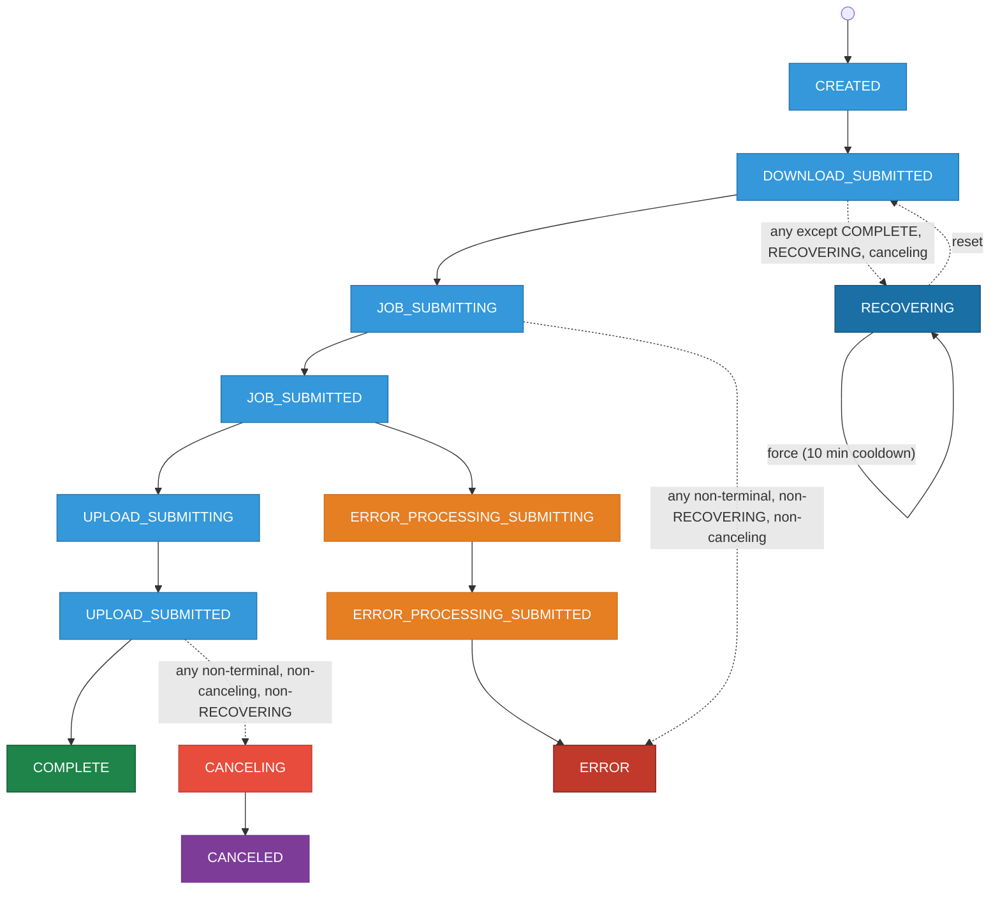

# Job State FSM

> **Viewing:** Install the VS Code extension
> [Markdown Preview Mermaid Support](https://marketplace.visualstudio.com/items?itemName=bierner.markdown-mermaid)
> and press `Ctrl+Shift+V`, or paste the diagram block into [mermaid.live](https://mermaid.live).

Dashed arrows are **representative**: the arrow originates from one state for diagram
clarity; the label describes the full set of valid source states.

